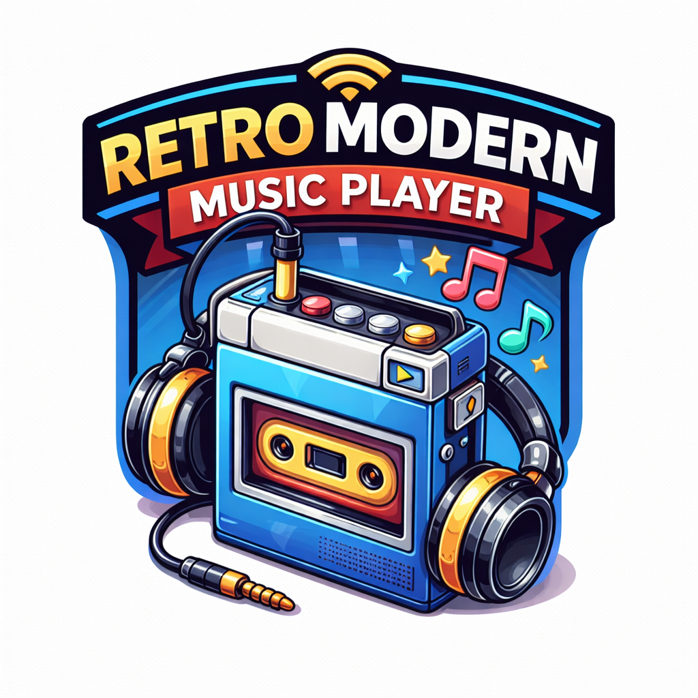

# Retro (yet) Modern music player! 

## Run Locally

**Prerequisites:**  Node.js

1. Install dependencies:
   `npm install`
2. build the project:
   `nmp run build`
3. Run the app:
   `npm run dev`
